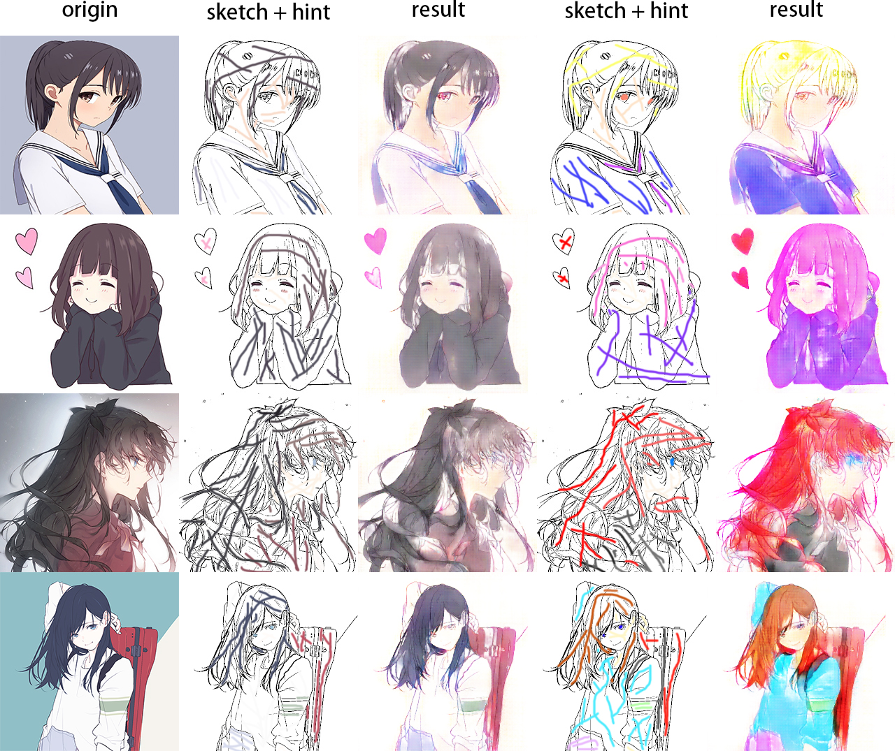

# Deep Paint

Auto-painting sketches by using cGAN.

# Required packages

- Tensorflow 1.6.0
- Tensorlayer 1.8.3
- OpenCV 3.4.1

# Demo

# Refs

[Generative Adversarial Networks](https://arxiv.org/abs/1406.2661)

[Conditional Generative Adversarial Nets](https://arxiv.org/abs/1411.1784)

[Unsupervised Representation Learning with Deep Convolutional Generative Adversarial Networks](https://arxiv.org/abs/1511.06434)

[U-Net: Convolutional Networks for Biomedical Image Segmentation](https://arxiv.org/abs/1505.04597)

[burness/tensorflow-101](https://github.com/burness/tensorflow-101/tree/master/deepcolor)
